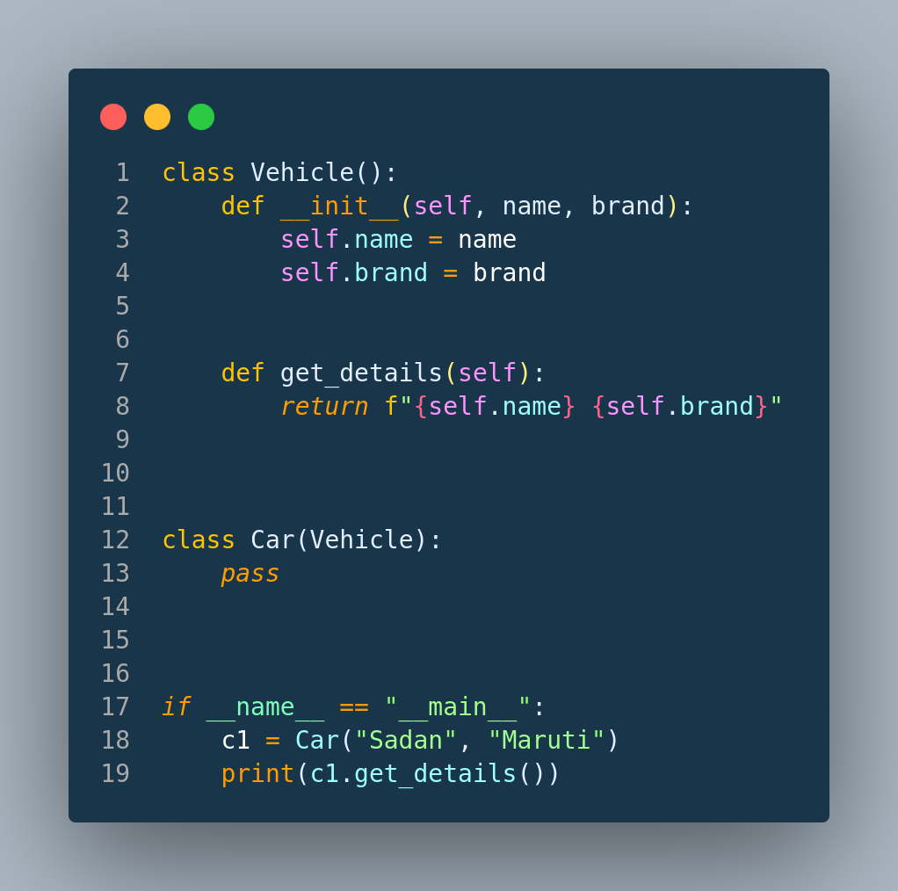
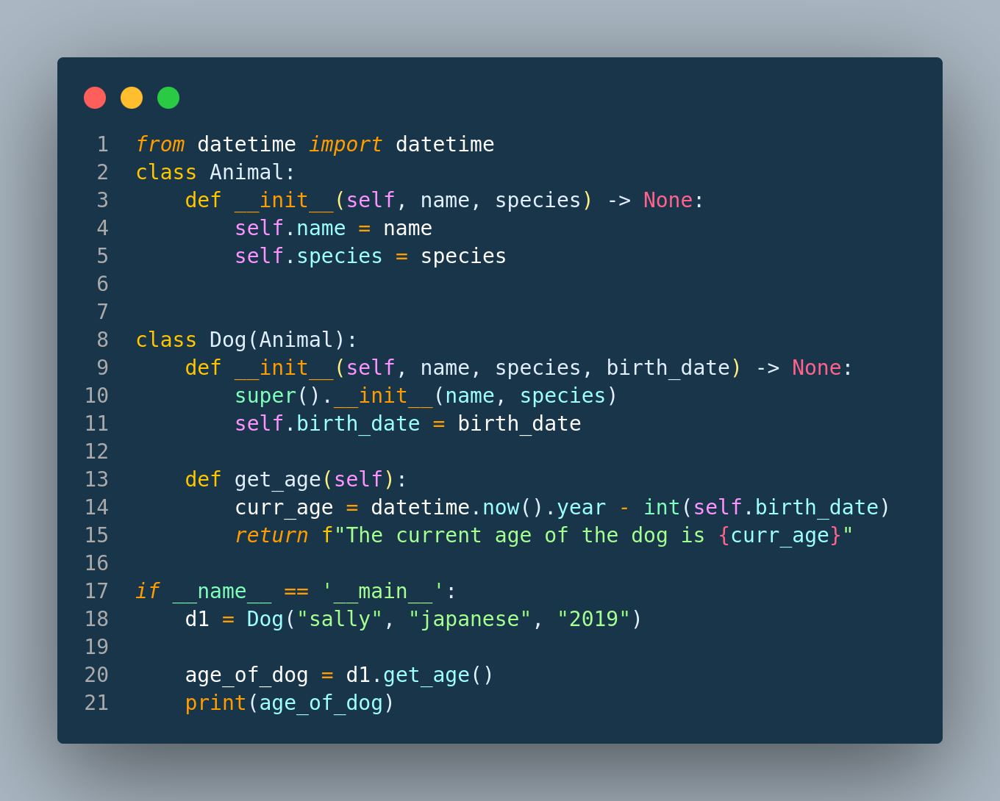

# Python-Programs
Basic Python programs from beginning to Advanced

## Table of Contents
- Basics of Python 
- Control Flow & Loops
- Lists, Sets, Tuples and Dictionaries
- Comprehensions of different Python Data Structures
- Generators
- Class and Objects
- Method Overriding and Overloading
- Setter and Getters
- Inheritence & Duck Typing
- Basics of Automation

## SnapShots of Codes
#### Inheritence

#### Super function in Python

